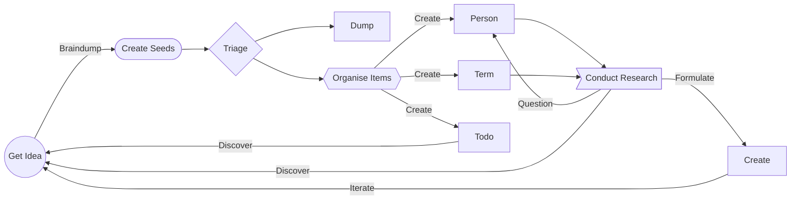

# 🪨🌱 The Obsidian Garden
> Please note that this is currently in active development and evolving - and riddled with spelling and grammer mistakes.

> If you are viewing this on [obsidian.garden](https://obsidian.garden) please be aware that [Obsidian Publish](https://help.obsidian.md/Plugins/Publish) does not yet support community plugins so not all featured are rendered - the project is best viewed in [[📇 Terms/Obsidian|Obsidian]] desktop.

The [[👩‍🌾 Gardening Tips/🪨🌱 Obsidian Garden|Obsidian Garden]] is an opinionated [[📇 Terms/Knowledge Management|Knowledge Management]] toolkit based on [Obsidian](https://obsidian.md) with a set of community [[👩‍🌾 Gardening Tips/🔌 Plugins|plugins]] and Markdown files.

It's designed to be a simple introduction to how you can design your own knowlege management system, rather than be a comprehensive on in itself - each person's garden is different and this is just one way to tend to it.

This set of tools is released under Creative Commons Zero v1.0 Universal [[LICENSE]]

## Building a Flow
The garden is designed for anyone who wants to collect data and gather information and use it to [[📇 Terms/Link|links]] and [[📇 Terms/Connection|connections]] and build ideas - like a book, a new software product, or just de-weeding and decluttering life.

Based on the system provided here, this diagram shows basic idea of some of discovery flow that is possible using [[📇 Terms/Obsidian|Obsidian]]. Starting with an idea, we create some [[👩‍🌾 Gardening Tips/🌱 Creating Seeds|seeds]] which we will triage later.  Some seeds won't make it and might get dumped.

The one's that do might go in to be new terms, or contacts or things to research.  Each of these things provide us more [[📇 Terms/Link|links]] and [[📇 Terms/Connection|connections]] that we can use to discover more knowlege.



## Getting Started
The easiest way to start is clone [this GitHub repository](https://github.com/tanepiper/obsidian-garden) containing the most up to date version, or download it as a zip file.

> `git clone https://github.com/tanepiper/obsidian-garden.git`

To get started [[👩‍🌾 Gardening Tips/🌱 Creating Seeds|create seeds]] with one of the  [[👩‍🌾 Gardening Tips/🌱 Creating Seeds#^599347|seed templates]] and start writing down ideas, book you want to read, projects you want to research.

There are a set of base that give you a set of options for collecting data - using the garden you should [[Link]] and `#tag` as much as possible and adding your own ⏣ Templates is encouraged.

Once you have your data you can start using dashboards like [[📚 Reading]] or [[👨‍👧‍👦 People]] to see what's upcoming and in progress, and how far you've come.

Work with [[👩‍🌾 Gardening Tips/⚠️ Statuses|statuses]] and [[👩‍🌾 Gardening Tips/🎯 Create Custom Dashboards|create custom dashboards]] to get the best out of your knowledge collection.

Once you're ready, feel free to change this readme and turn it into your home dashboard.

## Home
### Last 5 Files Edited
```dataview
table file.mtime as "Modified Time"
where file.mtime < (date(today) + dur(1 day))
sort file.mtime DESC
limit 5
```

### 🌱 Seed Box
```dataview
list from "🌱 Seed Box"
sort file.ctime DESC
```