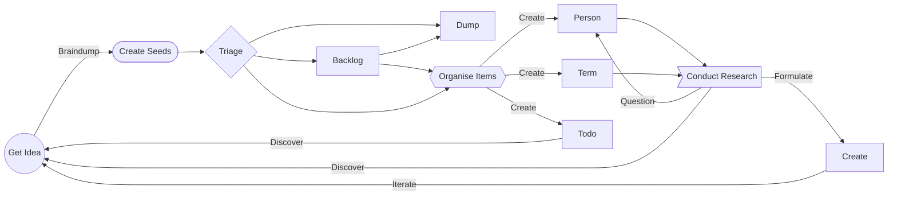

> ⚠️ The Obsidian Garden is currently in active development and evolving - it's being developed in the open but is subject to changes, and may contain broken links and errors
> ⚠️ If you are viewing this on [obsidian.garden](https://obsidian.garden) please be aware that [Obsidian Publish](https://help.obsidian.md/Plugins/Publish) does not yet support community plugins so not all featured are rendered - the project is best viewed in [Obsidian](https://obsidian.md) desktop.

# 👋 Welcome to your Knowledge Garden

[[👩‍🌾 Gardening Tips/🪨🌱 Obsidian Garden|🪨🌱 The Obsidian Garden]] is a open-source guide to 

💡 Great ideas happen when there is an [[📇 Terms/Connection|connection]] between knowledge and inspiration.

For thousands of years humans have tried to make sense of the world around them. Scientists, philosophers, writers, and even you and [[👨‍👧‍👦 People/🧑🏻‍💻 Tane Piper|I]] try to categorise it, understand how it works and create [[📇 Terms/System|systems]] that allow us to store and process this knowledge. 

From our own minds to a collection of half-filled notebooks in a drawer, from a bookshelf of unread books to your nearest library - all contain the inspiration we need to think of our next great idea

## Avoiding Information Rot

When it come to storing ideas - in the worst-case we use just our brain. When we do this, an idea can only exist within the boundaries of our own imagination. No one else yet knows about this idea (unless there is a [Multiple Discovery](https://en.wikipedia.org/wiki/Multiple_discovery) - but this also means you're losing out). 

Without communicating this idea the first real risk in [[🌱 Seed Box/Information Rot|Information Rot]] if you! 


- the concept that all information has a life span

and unless we somehow store it we're liable to lose grasp of it as quickly as it came to us.  We can tell people, and hope that they share - but without any information to back this up it's just conjecture and hearsay.

In some ways we need a *"second brain"* - a place that we can consciously put our stream of thoughts and ideas - a book we want to write, the next billion dollar app, or for just putting down all our random thoughts and timely notes.


Ideas form around us all the time but we live in a busy world full of distractions, of so much new information, and of a real risk of [[🌱 Seed Box/Information Rot|loosing important historical information]] too.

As humans, we tend to rely on our brains as a way to store and process everything: over thousands of years we've built systems to help categorise all our knowledge 

but we're at risk of missing them if we don't spot the [[📇 Terms/Connection|connections]].

Our world is a busy place full of distractions and we're bombarded with so much new information that everything we need to know grows exponentially - and as the web grows, older information becomes harder to find.


To escape these distractions we can visit our [[👩‍🌾 Gardening Tips/🪨🌱 Obsidian Garden|Obsidian Garden|Knowledge Garden]] to reconnect 

⏳ Good ideas take time to grow and nurture - sometimes it feels like need a *"second brain"* or at least a hard drive. What if we could plug into our brains to store all the contents of thoughts and ideas we have, things we've read, links we want to collect?

Using [[📇 Terms/Obsidian|Obsidian]] we can capture all our notes to create a  [[📇 Terms/Knowledge Management|Knowledge Management]] [[📇 Terms/System|System]]. Using [[Markdown]] documents we can start to form [[📇 Terms/Link|links]] between ideas, concepts, people, and actions.  Using `#tags` add a rich taxonomy through which allows for more wide searches to find deeper meaning.

Forming your own [[🗂 Projects/My New Garden/🌽 Knowledge Garden]] it will allow you to form an entire collection of information to harvest ideas, and view a [[📇 Terms/Knowledge Graph|Knowledge Graph]] that is a visual representation of all [[📇 Terms/Connection|connections]].

![[🖇 Attachments/the-knowledge-garden.png]]

## 💁🏽‍♀️ How to use the guide

[[👩‍🌾 Gardening Tips/🪨🌱 Obsidian Garden|🪨🌱 The Obsidian Garden]] is an opinionated but friendly [[📇 Terms/Knowledge Management|Knowledge Management]] guide based on [Obsidian](https://obsidian.md) with a set of community [[👩‍🌾 Gardening Tips/🪨 Obsidian/🔌 Plugins & 🌈 Theme|🔌 Plugins]] using [[📇 Terms/Obsidian|it]] to build the guide.

Built into the guide is it's own system - with a sensible default layout and guides on how to [[👩‍🌾 Gardening Tips/🌱 Creating Seeds|🌱 Creating Seeds]] and [[👩‍🌾 Gardening Tips/🎯 Create Custom Dashboards|🎯 Create Custom Dashboards]].

By using this guide, you can easily extend and remix it, or create your own new [[vault]] with some of the same techniques.

> ✅ This set of tools is released under Creative Commons Zero v1.0 Universal [[LICENSE]]

> If you are looking for a more fully featured [[📇 Terms/Knowledge Management|Knowledge Management]] system check out [LytKit](https://publish.obsidian.md/lyt-kit/_Start+Here)

## 🌱 Start By Planting

The garden is somewhere to [[👩‍🌾 Gardening Tips/🌱 Creating Seeds|plant seeds]] (your ideas) and let them grow. You don't need to be there all there time to tend to it, but when you do - you see new insights and information that wasn't visible before.

When you're ready to get started on your next great idea - a new book, the next billion dollar web app, or just de-weeding and tending to your current challenges -  having a knowledge garden allows you to start querying and questioning the data, building up outcomes from research topics and reference content and using it to discover more new great ideas.

Each [[👨‍👧‍👦 People|person]]'s garden is different - some like order, everything in rows and well manicured, some prefer it to be more organic and messy with the occasional tidy-up. All of them require regular tending and curating to make sure you can harvest information .

## 🧑‍🌾 Curating Your Garden

The garden is designed for anyone who wants to create their own [[📇 Terms/Knowledge Management|Knowledge Management]] system to currate content and ideas. The [[📇 Terms/Obsidian|Obsidian]] way is to use a lot of [[📇 Terms/Link|links]], `#tags` and [[📇 Terms/Connection|connections]] (and I mean A LOT!).

Starting by [[👩‍🌾 Gardening Tips/🌱 Creating Seeds|Creating Seeds]] - these will appear in your [[🪴 Grow Room]] - a dashboard that shows both the 🌱 Seed Box and your 🪵 Backlog.

From there you can prune or currate your content - I've tried to provide a simple model of how you can generate ideas.



## 💾 Installing The Guide

The easiest way to start is clone [this GitHub repository](https://github.com/tanepiper/obsidian-garden) containing the most up to date version, or download it as a zip file.

> `git clone https://github.com/tanepiper/obsidian-garden.git`

First [[👩‍🌾 Gardening Tips/🌱 Creating Seeds|create seeds]] with one of the templates (like [[⏣ Templates/🗒 Basic Note]]). and start writing down ideas, book you want to read, projects you want to research. As you type, you'll begin to notice words, people, places, and concepts that you want to start looking in to - creating [[📇 Terms/Link|links]] and clicking on them will create more seeds that you can collect more knowledge in.

### 💊 Triage the 🌱 Seed Box and the 

[[👩‍🌾 Gardening Tips/🌱 Creating Seeds|Seeds]] start off needing triaged - while a seed lives in the 🌱 Seed Box it's still needs nurtured so it can be ready to be planted in the correct location.

The box is where all new ideas go - random thoughts, long ideas, screenshots and pictures and audio notes. Work on files in the 🌱 Seed Box and only move them when ready.

Once a seed has been moved to the correct location you can update the [[👩‍🌾 Gardening Tips/⚠️ Statuses|status]] - these drive the dashboards like [[📚 Reading]] or [[👨‍👧‍👦 People]] - you can also learn to [[👩‍🌾 Gardening Tips/🎯 Create Custom Dashboards|Create Custom Dashboards]] allowing a more fine-grained view of what the garden contains.

Once you're ready, feel free to change this readme and turn it into your home dashboard.

## 🪵 Current Backlog
```dataview
table file.ctime as "Planted at" 
from "🪵 Backlog"
sort file.ctime DESC
```

## 🌱 Seed Box Latest 5
```dataview
table file.ctime as "Planted at" 
from "🌱 Seed Box"
sort file.ctime DESC
limit 5
```

## Last 5 Files Edited
```dataview
table file.mtime as "Last tended to"
where file.mtime < (date(today) + dur(1 day))
sort file.mtime DESC
limit 5
```

